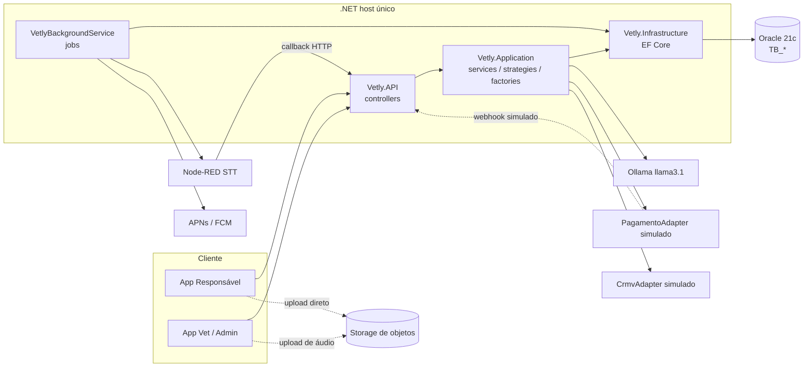
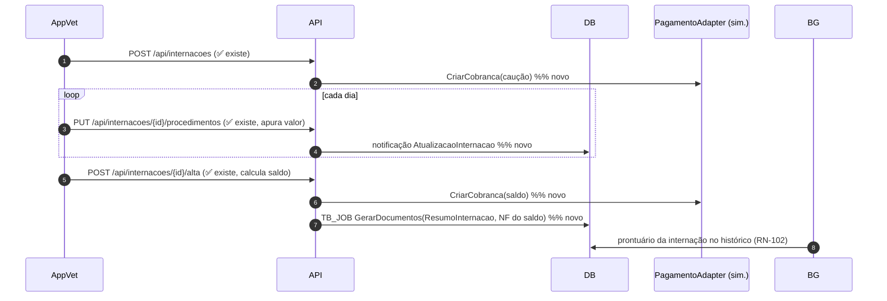
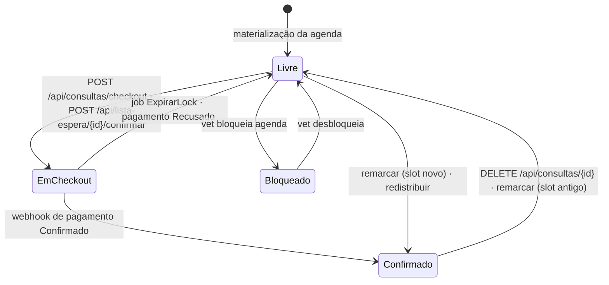
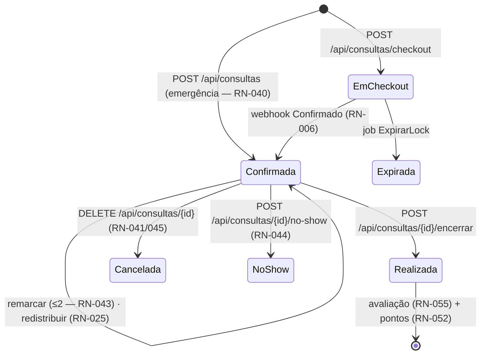
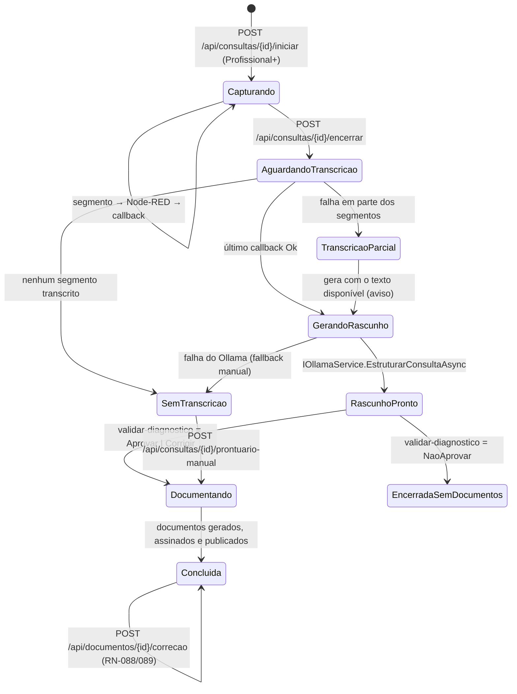

# Vetly MVP — Documentação Técnica de Endpoints e Comunicação
### Versão 2 — rebaseada na API .NET existente (`challenge-vetly/vetly-.net`)

> Fontes de verdade: `vetly-produto.md` (produto, fluxos §8, monetização), `vetly-tech.md` (RN-001 a RN-107, entidades, modelo de dados, §6 camadas) e **o código já existente**. Esta versão substitui a v1: onde a v1 propunha uma arquitetura do zero (Node/Postgres/PostGIS, rotas `/v1`, dinheiro em centavos), aqui tudo está reescrito para a stack real, e cada endpoint carrega o **status de trabalho** — o que já existe fica como está.

## Legenda de status (aplicada a todo endpoint, tabela e serviço)

| Status | Significado | O que o time faz |
|---|---|---|
| ✅ **EXISTE** | Implementado e coerente com as RNs. | Nada. Não mexer. |
| 🔤 **RENOMEAR** | Comportamento certo, contrato/rota/nome diverge. | Refatoração mecânica, sem mudar lógica. |
| 🔧 **EVOLUIR** | Endpoint existe, faltam campos/regras. | Estender DTO, serviço e migration. |
| 🆕 **NOVO** | Não existe nada. | Construir. |
| ⚠️ **CONFLITO** | O código contradiz uma decisão fechada de produto. | Ver §10 antes de codar. |

E a camada de implementação da §6 do tech: **C1** (banco + API reais), **C2** (API real, dependência externa simulada), **C3** (mock de front, sem endpoint).

---

## 0. Estado atual da API × alvo do MVP

### 0.1 Stack confirmada (não se discute mais)

| Camada | Tecnologia | Consequência para este documento |
|---|---|---|
| Framework | ASP.NET Core 10 (Web API, controllers) | Rotas `api/[controller]`, `[Authorize]`, `ProducesResponseType`. Sem prefixo `/v1`. |
| Arquitetura | Clean Architecture: `Vetly.Domain` → `Vetly.Application` → `Vetly.Infrastructure` → `Vetly.API` | Todo endpoint novo entra como Controller fino → `I{X}Service` → `I{X}Repository`. |
| ORM / Banco | EF Core 10 + `Oracle.EntityFrameworkCore`, Oracle 21c+ | **Sem PostGIS.** Geolocalização por colunas `NUMBER` + bounding box + Haversine (§6.3). Tabelas `TB_*`, PK `CHAR(36)`. |
| Auth | JWT Bearer, policies `ApenasAdmin` / `VeterinarioOuAdmin` | Personas via `ClaimTypes.Role`. Falta a role do Responsável (§2.2). |
| Docs | Scalar em `/scalar/v1` | Contratos deste doc devem aparecer via `ProducesResponseType` + XML docs. |
| IA | **Ollama local, `llama3.1`**, `IOllamaService` com `HttpClient` timeout 120s | O "serviço de IA" da v1 já existe e se chama `IOllamaService`. Não criar adaptador paralelo. |
| Erros | `ExceptionHandlingMiddleware` → RFC 7807 ProblemDetails; `BusinessRuleException(codigo, mensagem)` | O envelope `{ erro: {...} }` da v1 **está cancelado** (§2.4). |
| Testes | xUnit + Moq, 939 verdes (699 unitários + 240 integração — recontado direto do código em 2026-09-05; ver nota de verificação em §0.2) | Cada refatoração abaixo lista os testes que quebram. |
| Padrões | Factory (`IDocumentoFactory`), Strategy (`ICancelamentoStrategy`, `ISplitFinanceiroStrategy`), Repository, Soft delete, Value Object `Crmv` | Endpoints novos reaproveitam esses pontos de extensão em vez de criar outros. |

### 0.2 O que já está pronto e cobre o MVP

> ⚠️ **Nota de verificação (2026-09-05):** esta seção e a §0.3 originalmente descreviam um snapshot bem mais antigo da API (a versão anterior contava "51 verdes" de teste e estimava "~55% do MVP", com quase toda a lista abaixo marcada como inexistente). Uma reverificação direta no código de `vetly-.net` mostrou que isso está defasado — praticamente tudo listado como "falta por inteiro" já existe como endpoint hoje. O texto abaixo foi reescrito para refletir essa reverificação. **Escopo da verificação: existência de controller/endpoint via leitura do código-fonte, não auditoria RN-a-RN de completude de regra de negócio** — um endpoint listado aqui como existente pode ainda ter lacunas de regra que só uma auditoria RN-a-RN revelaria; isso não foi feito nesta passada.

Onboarding de vet/empresa/tutor/animal (CRUD + soft delete), agenda futura do vet, consulta (agendar, cancelar com Strategy de reembolso, finalizar, briefing, pré-sintomas, captura de áudio em segmentos, iniciar/encerrar, retorno, redistribuição), internação (abrir, procedimentos, alta com saldo), exames (solicitar, resultado, liberar), documentos (gerar por Factory, assinar, corrigir com versionamento), pagamento (registrar, split por Strategy, carteira do tutor), lembretes com régua de 3 tentativas, quatro rotas de IA sobre Ollama, **e adicionalmente (não presentes na versão anterior deste documento):** auth + onboarding do Responsável (`AuthController: registro/tutor, login, refresh, logout, trocar-senha`), board do pet (`GET /api/animais/{id}/board`), obrigações (`ObrigacoesController`), busca/matching por geolocalização (`BuscaController`), lista de espera (`ListaEsperaController`), fidelidade — saldo/extrato/resgate/cupons (`FidelidadeController`), avaliação — registrar/responder/moderar (`AvaliacoesController`), notificações in-app + preferências (`NotificacoesController`), colmeia — conceder/revogar/consultar acesso (`ColmeiaController`), mídia (`MidiaController`), dashboard do vet e consolidado financeiro (`DashboardController`, `FinanceiroController`).

### 0.3 O que falta / precisa de auditoria mais profunda

Ao nível de **existência de endpoint**, nenhuma área grande ficou de fora nesta reverificação. O que genuinamente não foi confirmado:
- **Push notification real** (APNs/FCM) — `NotificacoesController` cobre o lado in-app; não foi verificado se o envio push está implementado ou só a interface (`IPushService`) existe.
- **Profundidade de regra por endpoint** — esta seção não substitui uma auditoria RN-a-RN; o catálogo endpoint-a-endpoint nas seções seguintes (§1 em diante) pode conter marcadores de status (✅/🔧/🆕/⚠️) que ainda refletem o snapshot antigo e não foram individualmente reconferidos nesta passada — tratar com a mesma ressalva acima até uma auditoria dedicada.

### 0.4 De-para de nomenclatura — leia antes de qualquer refatoração

| Produto / `vetly-tech` | Código existente | Decisão |
|---|---|---|
| **Responsável** | `Tutor`, `TB_TUTOR`, `/api/tutores`, `TutorId` em toda entidade | **Mantém `Tutor` no código.** Renomear custaria migration + 12 arquivos + testes, sem ganho funcional. O app exibe "Responsável"; o backend fala `Tutor`. Este documento usa `Tutor` quando fala de código e "Responsável" quando fala de produto. |
| Consulta em `EM_CHECKOUT`/`CONFIRMADA`/… | `Consulta.Cancelada`, `.Finalizada`, `.StatusPagamento` (3 booleanos) | 🔧 Evoluir para `StatusConsulta` enum (§7.2). Booleanos não expressam a máquina da RN-035/038. |
| `PontosFidelidade`, `Avaliacao`, `Notificacao`, `Slot`, `AcessoColmeia`, `Midia` | — | 🆕 |
| `AvatarPet`, `EmpresaParceira`, `ItemMarketplace` | — | C3 / alvo. Não criar (§8). |

### 0.5 ⚠️ Conflito de numeração de RN

O `README-TECH.md` do repositório (documento legado, ver `legado/README-TECH.md`) usa uma numeração **própria** (`RN-008`, `RN-011`, `RN-015`, `RN-019/020/021`, `RN-024`, `RN-029/030`, `RN-031`, `RN-032/034`) que **colide com códigos diferentes** no `vetly-tech.md`. Exemplo: `RN-024` no código é "documento exige diagnóstico validado"; no tech é "vet desativado só obtém extrato". Isso quebra a rastreabilidade inteira.

**De-para (a aplicar nos XML docs e nas `BusinessRuleException`):**

| Código no repo | Onde | Código correto (`vetly-tech`) |
|---|---|---|
| RN-008 (desativação retorna agendamentos) | `VeterinarioService.DesativarAsync` | **RN-022 + RN-025** |
| RN-011 (CRMV regex + duplicidade) | `VeterinarioService.CriarAsync` | **RN-107** (e o regex é validação de formato, não validação junto ao conselho — §5.2) |
| RN-015 (consulta exige pagamento confirmado) | `ConsultaService.AgendarAsync` | **RN-006** |
| RN-016 (apuração da internação) | `InternacaoService` | **RN-100 / RN-101** |
| RN-019 / RN-020 / RN-021 (janelas de reembolso) | Strategies de cancelamento | **RN-014 / RN-041 / RN-042** |
| RN-024 (documento exige diagnóstico validado) | `DocumentoService.GerarAsync` | **RN-082 + RN-083** |
| RN-029 / RN-030 (régua de lembretes) | `LembreteService` | **RN-094 / RN-095** |
| RN-031 (finalizar exige receita assinada) | `ConsultaService.FinalizarAsync` | **RN-087** (com ressalva — §10, C-04) |
| RN-032 / RN-033 / RN-034 (correção de documento) | `DocumentoService.CorrigirAsync` | **RN-088 / RN-089** |

Refatoração de texto apenas: trocar as strings de código nas exceções e comentários. Os testes que assertam `BusinessRuleException.Codigo` precisam do mesmo update (`ConsultaServiceTests`, `DocumentoServiceTests`, `CancelamentoStrategyTests`).

---

## 1. Visão geral da arquitetura

### 1.1 Componentes

| Componente | Status | Papel |
|---|---|---|
| **App cliente** (Responsável / Vet / Admin) | 🆕 | Consome a API; captura o áudio da consulta; recebe push. |
| **Vetly.API** (ASP.NET Core 10) | ✅ | Controllers + middlewares. Único ponto de entrada HTTP. |
| **Vetly.Application** | ✅ | Serviços, Factories, Strategies, DTOs. Toda RN vive aqui. |
| **Vetly.Infrastructure** | ✅ | EF Core + Oracle, repositórios, migrations. |
| **`VetlyBackgroundService`** (`BackgroundService` no mesmo host) | 🆕 | Timers de negócio: expirar lock, promover lista de espera, régua de lembretes, expirar pontos/cupons/acesso colmeia, despachar áudio ao Node-RED, enviar push. Lê `TB_JOB` (§10 infra). |
| **Oracle 21c** | ✅ | Único banco. Novas tabelas seguem o padrão `TB_*`. |
| **Storage de objetos** (S3-compatível / MinIO em dev) | 🆕 | Foto do pet, mídia de pré-sintomas, **áudio da consulta**, resultados de exame, PDFs. CLOB no Oracle não serve para binário de áudio. |
| **Node-RED (STT)** | 🆕 | Fluxo que recebe o áudio e devolve texto por callback (§5.3). |
| **Ollama (`llama3.1`)** via `IOllamaService` | 🔧 | Já sugere diagnóstico/protocolo/triagem/orientações. Falta a operação de **estruturação a partir da transcrição** (RN-080). |
| **Push (APNs/FCM)** via `IPushService` | 🆕 | RN-007/092. |
| **Adaptadores simulados** | 🔧/🆕 | Pagamento (existe parcialmente como `PagamentoService`), CRMV, assinatura, geocodificação (§5). |

### 1.2 Diagrama



### 1.3 Síncrono × assíncrono

| Interação | Modo | Nota |
|---|---|---|
| App → API | Síncrono | Padrão de tudo o que já existe. |
| App → Storage | Síncrono, URL pré-assinada | A API nunca proxia bytes de áudio/imagem. |
| Lock de checkout, lista de espera, régua, expirações | Job no `BackgroundService` | Polling em `TB_JOB` a cada 30 s — suficiente para as janelas de 10/15 min do MVP. |
| Pagamento simulado | Cobrança síncrona, **confirmação por webhook** | Mantém o requisito do tech §7.5 mesmo mockado. |
| Áudio → Node-RED → texto | Assíncrono com callback | O vet não fica bloqueado. |
| Transcrição → Ollama | Síncrono dentro do job (timeout 120 s já configurado) | O front faz polling do rascunho. |
| Geração de documentos + push | Job | Encadeia Factory → storage → banco → push. |

---

## 2. Convenções de API

### 2.1 Rotas — mantém o padrão existente

- `api/[controller]` em português plural, minúsculo: `api/veterinarios`, `api/animais`, `api/tutores`, `api/consultas`, `api/internacoes`, `api/exames`, `api/documentos`, `api/pagamentos`, `api/empresas`, `api/lembretes`, `api/ia`.
- Controllers novos seguem o mesmo padrão: `api/fidelidade`, `api/avaliacoes`, `api/notificacoes`, `api/midia`, `api/busca`, `api/internos` (serviço-a-serviço).
- IDs `Guid` com constraint de rota `{id:guid}` — já é o padrão.
- Sub-recursos e ações: `POST api/consultas/{id}/finalizar` já estabelece a convenção verbo-em-rota. Mantida.
- ~~Prefixo `/v1`~~ **cancelado**: nenhuma rota existente tem versão e o Scalar já publica em `/scalar/v1`.

### 2.2 Autenticação e personas 🔧

Hoje: `POST /api/auth/token` recebe `{usuario, role}` **sem senha** e emite JWT de 8 h com roles `Admin` | `Veterinario`. Serve para desenvolvimento; não serve ao app.

Evolução mínima:

| Item | Hoje | Alvo |
|---|---|---|
| Roles | `Admin`, `Veterinario` | + **`Tutor`** (Responsável) e distinção `VetVinculado` × `VetAutonomo` via claim `persona`, e `VetDesativado` (RN-024) |
| Credencial | nenhuma | e-mail + senha (hash) para Tutor e Vet; `POST /api/auth/login` |
| Claims | `NameIdentifier`, `Role` | + `tutorId` \| `veterinarioId`, `empresaId`, `plano` |
| Escopo por linha | não existe | Todo serviço passa a receber o id do token e validar posse (RN-105/106) |
| Policies | `ApenasAdmin`, `VeterinarioOuAdmin` | + `ApenasTutor`, `TutorDono`, `VetComAcessoAoAnimal` (checa colmeia — RN-064/066) |

`POST /api/auth/token` fica como rota de desenvolvimento (marcada `[Obsolete]` e desabilitada fora de `Development`).

### 2.3 Formato de dados — alinhado ao código

- **Dinheiro: `decimal`** com 2 casas, como em `Pagamento.Valor` (`NUMBER(18,2)`). A proposta da v1 de trabalhar em centavos **está cancelada** — mudaria o schema e os testes de `PagamentoService` sem ganho.
- **Percentuais: `decimal` 0–100**, como `PercentualSplit`. Nada de basis points.
- Datas: `DateTime` UTC (`DateTime.UtcNow` já é o padrão do domínio), ISO 8601 no JSON.
- Enums serializados como **string** no JSON (`JsonStringEnumConverter`) — hoje saem como número, o que torna o contrato ilegível para o front. 🔤 Ajuste de uma linha em `Program.cs`.
- Listas grandes (`GET /api/consultas`, `/api/notificacoes`) 🔧 ganham paginação `?pagina=&tamanho=` com envelope `{ itens, total, pagina, tamanho }`. Hoje devolvem tudo.

### 2.4 Erros — RFC 7807, não o envelope da v1

`ExceptionHandlingMiddleware` já mapeia as exceções para ProblemDetails. Contrato:

```json
{
  "type": "https://vetly.com.br/erros/regra-negocio",
  "title": "Regra de negócio violada",
  "status": 422,
  "detail": "A consulta só pode ser agendada após confirmação do pagamento.",
  "instance": "/api/consultas",
  "codigo": "RN-006",
  "traceId": "00-f1a2..."
}
```

| Exceção | HTTP | Uso |
|---|---|---|
| `ValidationException` | 400 | Payload inválido. |
| — | 401 / 403 | Token ausente; persona/escopo/colmeia (RN-105/106/066/024). |
| `NotFoundException` | 404 | ✅ existe. |
| 🆕 `ConflitoDeEstadoException` | 409 | Slot tomado, limite de remarcações, avaliação duplicada. |
| `BusinessRuleException` | 422 | ✅ existe; `codigo` deve usar a numeração do `vetly-tech` (§0.5). |
| 🆕 `DependenciaIndisponivelException` | 503 | Ollama fora, Node-RED fora, CRMV `INDISPONIVEL`. |

### 2.5 Idempotência 🆕

Header `Idempotency-Key` obrigatório em `POST api/consultas/checkout`, `POST api/pagamentos`, `DELETE api/consultas/{id}`, `POST api/consultas/{id}/remarcar`, `POST api/fidelidade/resgates`. Filtro `IdempotencyFilter` grava `(chave, usuarioId, rota) → resposta` em `TB_IDEMPOTENCIA` por 24 h.

### 2.6 Mídia 🆕

`POST api/midia/upload-url` → `{ midiaId, uploadUrl, expiraEm }`; app faz `PUT`; o `midiaId` viaja nos payloads de negócio. Leitura por `GET api/midia/{id}/url`. Conteúdo clínico nunca em URL pública (RN-090).

---

## 3. Catálogo de endpoints por domínio

Cada tabela lista a rota **como está hoje** (quando existe) e o alvo. Colunas: **St.** = status (§legenda), **Cam.** = camada, **RNs** = numeração do `vetly-tech`.

### 3.1 Auth e sessão — `AuthController`

| Rota | St. | Cam. | RNs | Trabalho |
|---|---|---|---|---|
| `POST /api/auth/token` | 🔤 | C1 | — | Restringir a `Development`; marcar `[Obsolete]`. |
| `POST /api/auth/registro/tutor` | 🆕 | C1 | RN-060 | Cria `Tutor` + credencial; devolve token com `consentimentoPendente=true`. |
| `POST /api/auth/login` | 🆕 | C1 | RN-022, RN-024 | E-mail + senha; role por tipo de usuário; `Veterinario.Ativo=false` ⇒ role `VetDesativado`. |
| `POST /api/auth/refresh` · `POST /api/auth/logout` | 🆕 | C1 | — | Refresh rotativo em `TB_REFRESH_TOKEN`. |
| `GET /api/auth/me` | 🆕 | C1 | RN-060, RN-107 | Perfil + pendências (consentimento, CRMV, cadastro incompleto). |

```jsonc
// POST /api/auth/login
{ "email": "ana@ex.com", "senha": "…" }
// 200
{ "token": "eyJ…", "refreshToken": "…", "expiraEm": "…",
  "role": "Tutor", "tutorId": "3f1c…", "consentimentoPendente": true }
```

### 3.2 Tutor (Responsável) — `TutoresController`

| Rota | St. | Cam. | RNs | Trabalho |
|---|---|---|---|---|
| `GET /api/tutores` | ✅ | C1 | RN-106 | Restringir a `ApenasAdmin` (hoje qualquer autenticado lista todos). |
| `GET /api/tutores/{id}` · `PUT /api/tutores/{id}` | 🔧 | C1 | — | Adicionar checagem de posse (`sub == id` ou Admin). |
| `GET /api/tutores/{id}/animais` | ✅ | C1 | — | Manter. |
| `POST /api/tutores` | ✅ | C1 | — | Manter (usado pelo Admin/vet no balcão). O app usa `/api/auth/registro/tutor`. |
| `DELETE /api/tutores/{id}` | ✅ | C1 | RN-062 | Soft delete + anonimização já implementados. |
| `PUT /api/tutores/{id}/consentimentos` | 🆕 | C1 | RN-060, RN-061, RN-062, RN-077, RN-093 | `Tutor.RegistrarConsentimento` já existe no domínio, **sem endpoint**. Expor + adicionar as finalidades faltantes: `Promocoes` e `DadosAgregados`, e `DataRevogacao` por finalidade. |
| `GET /api/tutores/{id}/consentimentos` | 🆕 | C1 | RN-061 | Lista com `concedido`, `concedidoEm`, `revogadoEm`. |
| `POST /api/tutores/{id}/dispositivos` · `DELETE …/{dispositivoId}` | 🆕 | C1 | RN-007, RN-092 | Push token por dispositivo. |

> Middleware 🆕 `ConsentimentoAtendimentoFilter`: sem `ConsentimentoAtendimento=true`, qualquer rota de negócio do Tutor devolve 422 `RN-060`.

### 3.3 Animais (pets, obrigações, board) — `AnimaisController`

| Rota | St. | Cam. | RNs | Trabalho |
|---|---|---|---|---|
| `GET /api/animais` · `GET /api/animais/{id}` | 🔧 | C1 | RN-105 | Filtrar por posse: Tutor vê os seus; vet vê os que atendeu/agendados. |
| `POST /api/animais` · `PUT /api/animais/{id}` | 🔧 | C1 | RN-081, RN-020, RN-046 | **Migration obrigatória**: faltam `PESO_KG` (RN-081 — a IA não sugere dose sem peso), `SEXO`, `CASTRADO`, `FOTO_MIDIA_ID`, `ALERGIAS`, `CONDICOES_PREEXISTENTES`, `CARTEIRA_VACINACAO`. Ao criar, gerar o calendário de obrigações. |
| `DELETE /api/animais/{id}` | ✅ | C1 | — | Soft delete. |
| `GET /api/animais/{id}/prontuarios` | ✅ | C1 | RN-063 | Histórico longitudinal já existe. 🔧 aplicar filtro de colmeia quando quem chama é vet (§3.10). |
| `GET /api/animais/{id}/exames` | ✅ | C1 | RN-104 | 🔧 para Tutor, devolver só `LiberadoAoTutor=true`. |
| `GET /api/animais/{id}/board` | 🆕 | C1 | RN-020, RN-090, RN-096 | Board do pet: obrigações, próximos agendamentos, documentos recentes e `avatarEstado` (só o enum — o avatar é C3, §8). |
| `GET /api/animais/{id}/obrigacoes` | 🆕 | C1 | RN-046, RN-047 | Calendário. |
| `PATCH /api/animais/{id}/historico/{registroId}/ocultar` | 🆕 | C1 | RN-068 | Bloqueia ocultar alerta de segurança. |
| `GET /api/animais/{id}/acessos` | 🆕 | C1 | RN-067 | `TB_LOG_ACESSO_PRONTUARIO` visível ao Responsável. |

```jsonc
// POST /api/animais  (campos novos em negrito no doc: pesoKg, sexo, castrado, alergias…)
{ "nome": "Thor", "especie": "Canino", "raca": "Golden Retriever", "dataNascimento": "2023-04-10T00:00:00Z",
  "tutorId": "3f1c…", "pesoKg": 31.5, "sexo": "Macho", "castrado": true,
  "alergias": ["Dipirona"], "condicoesPreexistentes": ["Displasia leve"], "fotoMidiaId": "9a2b…",
  "carteiraVacinacao": [ { "tipo": "V10", "aplicadaEm": "2026-03-01T00:00:00Z" } ] }
// 201
{ "id": "…", "obrigacoes": [ { "id": "…", "tipo": "Vacina", "dataLimite": "2027-03-01T00:00:00Z", "status": "EmDia" } ],
  "avatarEstado": "Saudavel" }
```

### 3.4 Busca e matching — `VeterinariosController` + `BuscaController`

| Rota | St. | Cam. | RNs | Trabalho |
|---|---|---|---|---|
| `GET /api/veterinarios` · `/{id}` | ✅ | C1 | — | Manter. |
| `GET /api/veterinarios/regiao/{uf}` | ✅ | C1 | RN-027 | **Vira o fallback oficial** da RN-027 (permissão de localização negada). Não remover. |
| `GET /api/veterinarios/{id}/agenda` | ✅ | C1 | RN-034 | Hoje devolve consultas futuras. Mantém para o dashboard do vet. |
| `GET /api/veterinarios/{id}/disponibilidade` | 🆕 | C1 | RN-034, RN-035 | Slots livres por dia, para o Responsável escolher horário. |
| `GET /api/busca` | 🆕 | C1 | RN-001, RN-002, RN-026 a RN-033, RN-057, RN-107 | Matching por raio + score 40/30/30. Depende da migration de coordenadas (§6.2) e de `TB_SLOT`. |
| `POST /api/veterinarios` · `PUT` · `DELETE` | ✅ | C1 | RN-022, RN-025, RN-107 | Já com `ApenasAdmin` e retorno de agendamentos futuros no delete. 🔧 só adicionar as colunas de endereço/coordenada e o disparo da validação de CRMV. |
| `PUT /api/veterinarios/{id}/agenda-config` | 🆕 | C1 | RN-034 | Dias, horários, duração, intervalo → materializa `TB_SLOT` por 60 dias. |
| `PUT /api/veterinarios/{id}/servicos` | 🆕 | C1 | RN-032, RN-074 | Serviço, valor, aceita plano pet. Hoje o valor da consulta vem solto no pagamento. |
| `GET/POST /api/veterinarios/{id}/crmv` | 🔧 | **C2** | RN-107 | Hoje `Crmv` é um Value Object com regex `^\d{4,6}-[A-Z]{2}$` + checagem de duplicidade — isso é **formato**, não validação junto ao conselho. Adicionar `ICrmvAdapter` (§5.2) e o estado `PendenteValidacao`, que impede publicação no matching. |

```jsonc
// GET /api/busca?animalId=…&necessidade=ConsultaRotina&lat=-23.56&lng=-46.65&raioKm=10&atendeHoje=false
{ "itens": [
    { "prestadorId": "…", "tipo": "Empresa", "nome": "Clínica Vida Pet", "distanciaKm": 1.8,
      "nota": 4.7, "numAvaliacoes": 41, "seloNovo": false, "proximoHorario": "2026-09-01T16:30:00Z",
      "valorServico": 200.00, "score": 0.86 } ],
  "raioAplicadoKm": 10, "origem": "Gps", "total": 12, "pagina": 1, "tamanho": 20 }
```

### 3.5 Agendamento — `ConsultasController`

O ponto de maior divergência. Hoje o fluxo é **pagamento primeiro, consulta depois**: `POST /api/pagamentos` → confirmar → `POST /api/consultas` com `PagamentoId` (RN-015 do repo = RN-006 do tech). A RN-035 exige o inverso: **lock do slot → checkout → pagamento → webhook confirma**.

Decisão para minimizar refatoração: **manter `POST /api/consultas` como está** (serve à emergência presencial da RN-040 e ao balcão, onde o pagamento é no ato) e **adicionar** a trilha de checkout para o app.

| Rota | St. | Cam. | RNs | Trabalho |
|---|---|---|---|---|
| `GET /api/consultas` (filtros `dataInicio`, `dataFim`, `veterinarioId`, `cancelada`) | 🔧 | C1 | RN-105, RN-106 | Adicionar `tutorId`, `animalId`, `status` e paginação; filtrar por escopo do token. |
| `GET /api/consultas/{id}` · `/veterinario/{id}` · `/animal/{id}` | ✅ | C1 | — | Manter. |
| `POST /api/consultas` | ✅ | C1 | **RN-040** | Passa a ser oficialmente a rota de **emergência/no ato**. Sem lock, sem slot. Nenhuma mudança de código. |
| `POST /api/consultas/checkout` | 🆕 | C1 | RN-003, RN-035, RN-039, RN-042 | Lock de 10 min no slot; cria consulta `EmCheckout`; devolve política de reembolso. Idempotente. |
| `PUT /api/consultas/{id}/pre-sintomas` | 🆕 | C1 | RN-005, RN-036 | Texto guiado (`CLOB` JSON) + `midiaIds`. Alimenta o briefing e a IA. |
| `GET /api/consultas/{id}/simulacao-cancelamento` | 🆕 | C1 | RN-014, RN-041, RN-042 | Expõe a Strategy **sem executar** — o app precisa mostrar o valor antes de confirmar. Reusa `ICancelamentoStrategy`. |
| `DELETE /api/consultas/{id}` | 🔧 | C2 | RN-014, RN-041, RN-042, RN-052, RN-059 | ✅ o Strategy já funciona. Falta: (a) `percentualRetencao: 30m` está **hardcoded** em `ConsultaService.CancelarAsync` — ler de `Empresa.PercentualRetencaoParcial` (RN-042); (b) liberar o slot; (c) estornar pontos; (d) invalidar avaliação; (e) notificar. |
| `POST /api/consultas/{id}/remarcar` | 🆕 | C1 | RN-013, RN-043 | `Consulta.Reagendar` já existe no domínio e é chamado por `AtualizarAsync` **sem contador**. Adicionar `ContadorRemarcacoes` (limite 2) e troca de slot. |
| `POST /api/consultas/{id}/no-show` | 🆕 | C1 | RN-038, RN-044 | Sem reembolso. |
| `GET /api/consultas/{id}/briefing` | 🔧 | C1 | RN-005, RN-036, RN-064 a RN-068, RN-078 | ✅ já traz animal + 5 últimas consultas + 3 exames. Falta: **pré-sintomas**, medicações em uso, peso, filtro de colmeia e gravação do `LogAcessoProntuario`. |
| `POST /api/lista-espera` · `DELETE /{id}` · `POST /{id}/confirmar` | 🆕 | C1 | RN-004, RN-037 | Fila com prioridade de 15 min. |

```jsonc
// POST /api/consultas/checkout   (Idempotency-Key)
{ "animalId": "…", "prestadorId": "…", "slotId": "…", "servicoId": "…" }
// 201
{ "consultaId": "…", "status": "EmCheckout", "lockExpiraEm": "2026-09-01T14:10:00Z",
  "resumo": { "prestador": "Clínica Vida Pet", "servico": "Consulta de rotina",
              "dataHora": "2026-09-05T14:00:00Z", "valor": 200.00, "modalidade": "Presencial",
              "politicaReembolso": { "integralAcimaDeHoras": 24, "semReembolsoAbaixoDeHoras": 2,
                                     "percentualRetencaoParcial": 30.0 } } }

// GET /api/consultas/{id}/simulacao-cancelamento
{ "estrategiaAplicada": "Reembolso Parcial", "horasDeAntecedencia": 20.5,
  "valorPago": 200.00, "percentualRetencao": 30.0, "valorRetido": 60.00,
  "valorReembolso": 140.00, "liquidacao": "Simulada" }
```

### 3.6 Pagamento e financeiro — `PagamentosController`

| Rota | St. | Cam. | RNs | Trabalho |
|---|---|---|---|---|
| `GET /api/pagamentos` · `/{id}` | 🔧 | C1 | RN-106 | Filtrar por escopo (Tutor vê os seus; Admin, os da unidade). Paginação. |
| `POST /api/pagamentos` | 🔧 | **C2** | RN-006, RN-035, RN-051, RN-070 | Hoje só grava `Pendente`. Passa a: calcular split **na Vetly**, aplicar cupom de fidelidade, chamar `IPagamentoAdapter.CriarCobranca` e devolver instruções. Não confirma a consulta. |
| `POST /api/pagamentos/{id}/processar-split` | ⚠️🔧 | C1 | RN-070, RN-051 | **Conflito C-01 (§10):** as Strategies usam percentual por persona (autônomo 80 / vinculado 60), mas a decisão fechada é take rate **por plano** (Básico 15% / Profissional 12% / Enterprise 10%). Refatorar `ISplitFinanceiroStrategy` para decidir por `PlanoAssinatura`. Passa a ser chamado internamente no `POST /api/pagamentos`, não por rota manual. |
| `POST /api/internos/pagamentos/webhook` | 🆕 | C2 | RN-006, RN-035, RN-071 | Estado autoritativo: confirma pagamento → consulta `EmCheckout → Confirmada` → slot `Confirmado` → gera NF → notifica. |
| `GET /api/pagamentos/{id}/status` | 🆕 | C1 | RN-006 | Polling do app durante o checkout. |
| `GET /api/tutores/{id}/carteira` | 🆕 | C1 | RN-041, RN-071 | Pagamentos, recibos, NFs, reembolsos. |
| `GET /api/empresas/{id}/financeiro` | 🆕 | C1 | RN-106 | Consolidado da unidade com as vedações. Nunca dados bancários de vets. |

```jsonc
// POST /api/pagamentos  (Idempotency-Key)
{ "tutorId": "…", "consultaId": "…", "valor": 200.00, "meioPagamento": "Pix", "cupomId": null }
// 202
{ "id": "…", "statusPagamento": "Pendente", "valor": 200.00,
  "split": { "plano": "Enterprise", "takeRate": 10.0, "comissaoVetly": 20.00, "repasse": 180.00 },
  "descontoFidelidade": null, "liquidacao": "Simulada",
  "instrucoes": { "tipo": "PixSimulado", "codigo": "vetly-sim-7f2a" } }

// Com resgate de R$ 20 (RN-051, faixa 60/40): comissão 20,00 → 8,00 e repasse 180,00 → 172,00
{ "descontoFidelidade": { "cupomId": "…", "valor": 20.00, "faixa": "De10a30",
    "absorvidoVetly": 12.00, "absorvidoPrestador": 8.00 },
  "split": { "comissaoVetly": 8.00, "repasse": 172.00 } }
```

### 3.7 Consulta, captura de áudio e IA — `ConsultasController` + `OllamaController`

Esta é a parte que mais muda. O que existe hoje é uma IA **de prompt avulso**: o vet manda sintomas digitados e recebe sugestões. O produto exige a IA **alimentada pela fala capturada** (RN-008/009/079/080).

| Rota | St. | Cam. | RNs | Trabalho |
|---|---|---|---|---|
| `POST /api/ia/diagnostico` | ✅ | C1 | RN-078 | Mantém. Vira ferramenta de apoio manual (útil no plano Básico). |
| `POST /api/ia/protocolo` | 🔧 | C1 | **RN-081** | Já recebe `pesoKg`. Adicionar guarda: peso ausente/zero ⇒ 422, sem sugestão de dose. |
| `POST /api/ia/triagem` · `POST /api/ia/orientacoes` | ✅ | C1 | RN-078 | Mantém. |
| `POST /api/ia/estruturar` | 🆕 | C1 | **RN-080**, RN-081 | Nova operação em `IOllamaService`: recebe transcrição + contexto clínico e devolve queixa, achados, diagnóstico, protocolo, orientações. É o coração do fluxo. |
| `POST /api/consultas/{id}/iniciar` | 🆕 | C1 | RN-008, RN-079, RN-085 | Grava `IniciadaEm`, abre `SessaoCaptura`, devolve parâmetros de gravação. Plano Básico: aceita mas não abre captura (RN-085). |
| `POST /api/consultas/{id}/captura/segmentos` | 🆕 | C1 | RN-009, RN-079 | Recebe `midiaId` do segmento de áudio; enfileira job de transcrição. Fora da janela ⇒ 409. |
| `GET /api/consultas/{id}/captura` | 🆕 | C1 | RN-009 | Estado dos segmentos + texto parcial. |
| `POST /api/internos/stt/callback` | 🆕 | C1 | RN-009, RN-080 | **Node-RED → API.** Grava transcrição; quando o último segmento chega, dispara a estruturação. |
| `POST /api/consultas/{id}/encerrar` | 🆕 | C1 | RN-008, RN-038, RN-052, RN-055 | Fecha a janela, marca a consulta como **Realizada**, credita pontos, abre avaliação, dispara `POST /api/ia/estruturar` via job. |
| `GET /api/consultas/{id}/rascunho` | 🆕 | C1 | RN-080, RN-081, RN-082 | Polling do vet até `Pronto`. |
| `PUT /api/consultas/{id}/validar-diagnostico` | 🔧 | C1 | **RN-082**, RN-084 | ✅ a rota existe e já é o gate dos documentos. Hoje é um `void` que seta `DiagnosticoValidado=true`. Evoluir para receber a **decisão de três vias**: `Aprovar` \| `Corrigir` (+ `conteudoFinal`, que vira estado autoritativo sem re-inferência) \| `NaoAprovar` (encerra sem documentos). Gravar `TB_LOG_AUDITORIA_IA`. |
| `POST /api/consultas/{id}/finalizar` | 🔧⚠️ | C1 | RN-087 | ✅ existe e exige receita assinada. **Conflito C-04 (§10):** nem toda consulta gera receita. Passar a exigir assinatura *apenas quando houver receita*. |
| `POST /api/consultas/{id}/prontuario-manual` | 🆕 | C1 | RN-085 | Caminho do plano Básico e do fallback de falha de transcrição. |
| `POST /api/consultas/{id}/retorno` | 🆕 | C1 | RN-046, RN-065 | Cria obrigação de retorno e estende o acesso da colmeia. |

```jsonc
// POST /api/consultas/{id}/iniciar → 200
{ "sessaoCapturaId": "…", "capturaAtiva": true, "iniciadaEm": "2026-09-05T14:02:11Z",
  "gravacao": { "formato": "audio/webm;codecs=opus", "segundosPorSegmento": 30, "sampleRate": 16000 },
  "avisos": [] }   // ["PesoAusente"] se Animal.PesoKg == null (RN-081)

// POST /api/consultas/{id}/captura/segmentos
{ "sequencia": 4, "midiaId": "…", "duracaoMs": 30000, "inicioRelativoMs": 90000 }
// 202 → { "segmentoId": "…", "sequencia": 4, "estado": "Recebido" }

// POST /api/internos/stt/callback   (header X-Vetly-Service-Token)
{ "segmentoId": "…", "consultaId": "…", "status": "Ok",
  "texto": "Paciente apresenta vômito há um dia, abdome doloroso à palpação…",
  "confianca": 0.91, "idioma": "pt-BR",
  "trechos": [ { "inicioMs": 0, "fimMs": 4200, "texto": "Paciente apresenta vômito há um dia" } ],
  "motor": { "nome": "stt-flow", "versao": "1.3.0" } }

// POST /api/ia/estruturar   (API → Ollama por trás; RN-080)
{ "consultaId": "…",
  "contexto": { "especie": "Canino", "raca": "Golden Retriever", "idadeAnos": 3, "pesoKg": 31.5,
                "alergias": ["Dipirona"], "alertasAtivos": ["Displasia leve"],
                "preSintomas": { "queixaPrincipal": "Vômito desde ontem" },
                "historicoRelevante": "Consulta em 2026-05: gastrite" },
  "transcricao": { "texto": "…", "trechos": [ … ] } }
// 200
{ "queixa": "Vômito há 24h após ingestão de osso.",
  "achados": ["Abdome doloroso à palpação", "Desidratação leve", "T 39,4 °C"],
  "diagnostico": { "principal": "Gastrite aguda", "diferenciais": ["Corpo estranho"] },
  "protocolo": [ { "medicamento": "Omeprazol", "doseMgPorKg": 1, "doseCalculadaMg": 31.5,
                   "via": "VO", "frequencia": "1x/dia", "duracaoDias": 5 } ],
  "orientacoes": "Jejum de 12h, água em pequenas quantidades…",
  "atestado": { "sugerido": false, "tipo": null }, "retornoSugeridoEmDias": 7,
  "avisos": [], "modelo": { "nome": "llama3.1", "versao": "…" } }

// PUT /api/consultas/{id}/validar-diagnostico  (payload novo — hoje a rota não recebe corpo)
{ "decisao": "Corrigir",
  "conteudoFinal": { "queixa": "…", "achados": ["…"], "diagnostico": { … }, "protocolo": [ … ],
                     "orientacoes": "…", "atestado": { "emitir": true, "tipo": "Saude" } },
  "assinatura": { "nomeDigitado": "Dra. Marina Costa", "crmv": "12345-SP" } }
// 202 → { "cicloEstado": "Documentando", "auditoriaId": "…" }
```

**Contexto entregue ao Ollama (RN-078):** só o que o vet enxerga naquele atendimento (colmeia vigente ou registros próprios) + pré-sintomas + espécie/raça/idade/peso. A API monta o snapshot; o `IOllamaService` nunca recebe um `animalId` para "buscar mais".

### 3.8 Documentos — `DocumentosController`

| Rota | St. | Cam. | RNs | Trabalho |
|---|---|---|---|---|
| `GET /api/documentos/consulta/{id}` · `GET /api/documentos/{id}` | ✅ | C1 | RN-090 | 🔧 gravar log de acesso quando quem chama é vet. |
| `POST /api/documentos/consulta/{id}?tipo={TipoDocumento}` | 🔧 | C1 | RN-010, RN-083, RN-086 | ✅ Factory pronto para os 4 tipos e o gate de diagnóstico validado já existe. Evoluir: gerar a partir do **estado final** (RN-083, formatação sem nova inferência), persistir o conteúdo (hoje `TB_DOCUMENTO` guarda só metadados — falta `CONTEUDO CLOB` e `PDF_MIDIA_ID`) e permitir geração em lote pelo job. |
| `POST /api/documentos/{id}/assinar` | 🔤 | **C2** | RN-087 | Hoje é um `Assinar()` sem payload. Passar a receber `{ nomeDigitado }` e delegar ao `IAssinaturaAdapter`, que carimba o método (`NomeDigitado` no MVP, ICP-Brasil em produção) e devolve `habilitaControlados=false`. |
| `POST /api/documentos/{id}/correcao` | ✅ | C1 | RN-088, RN-089 | Versionamento com `VersaoOriginalId` + justificativa após 24 h **já implementado corretamente**. Nada a fazer. |
| `POST /api/documentos/{id}/publicar` | 🆕 | C1 | RN-011, RN-090 | Publica no board do pet + entrada no histórico + notificação. Hoje o documento é gerado e "fica lá". |

### 3.9 Internação e exames — `InternacoesController`, `ExamesController`

| Rota | St. | Cam. | RNs | Trabalho |
|---|---|---|---|---|
| `GET /api/internacoes` · `/{id}` | ✅ | C1 | RN-100 | Manter. |
| `POST /api/internacoes` | 🔧 | C2 | RN-100, RN-101 | ✅ abre com caução. Falta criar o `Pagamento` tipo caução pelo adaptador. |
| `PUT /api/internacoes/{id}/procedimentos` | ✅ | C1 | RN-100 | Apuração diária já implementada. 🔧 disparar notificação diária ao Responsável. |
| `POST /api/internacoes/{id}/alta` | 🔧 | C2 | RN-102 | ✅ calcula saldo. Falta: gerar resumo + NF do saldo, criar o pagamento do saldo e incorporar ao histórico. |
| `GET /api/exames` · `/{id}` · `POST /api/exames` | ✅ | C1 | RN-103 | Manter. 🔧 notificar o Responsável com as orientações de preparo. |
| `PUT /api/exames/{id}/resultado` | ✅ | C1 | RN-104 | Manter. 🔧 aceitar `midiaIds` além do `resultado` texto (hoje é `CLOB`), para laudos em PDF/imagem. |
| `PUT /api/exames/{id}/liberar` | ✅ | C1 | RN-104, RN-090 | Manter. 🔧 notificar o Responsável. |

### 3.10 Colmeia e LGPD 🆕

| Rota | St. | Cam. | RNs | Trabalho |
|---|---|---|---|---|
| (filtro) `VetComAcessoAoAnimalHandler` | 🆕 | C1 | RN-063 a RN-069 | Authorization handler aplicado a `GET /api/animais/{id}/prontuarios`, `/exames` e ao briefing: acesso total se `TB_ACESSO_COLMEIA` vigente; senão, só o que o vet produziu. Alerta de segurança sempre visível. |
| (job) conceder/expirar acesso | 🆕 | C1 | RN-064, RN-065 | Concede na confirmação da consulta se `ConsentimentoCompartilhamento=true`; expira em consulta + 24 h + retornos. |
| `POST /api/veterinarios/{id}/extrato-atendimentos` | 🆕 | C1 | RN-024 | Única rota permitida à role `VetDesativado`; sem dados pessoais do Tutor/animal. |

### 3.11 Fidelidade 🆕 — `FidelidadeController`

| Rota | St. | Cam. | RNs |
|---|---|---|---|
| `GET /api/fidelidade/saldo` | 🆕 | C1 | RN-048, RN-049, RN-050 |
| `GET /api/fidelidade/extrato` | 🆕 | C1 | RN-047, RN-052 |
| `POST /api/fidelidade/resgates/simular` | 🆕 | C1 | RN-017, RN-049, RN-051 |
| `POST /api/fidelidade/resgates` | 🆕 | C1 | RN-018, RN-050, RN-053, RN-054 |
| `GET /api/fidelidade/cupons` · `/{id}` | 🆕 | C1 | RN-053 |

Crédito de pontos acontece **dentro de `POST /api/consultas/{id}/encerrar`** (serviço pago: 1 pt/R$; obrigação cumprida no prazo: 50 pts; ambos × multiplicador do tier) e o estorno dentro de `DELETE /api/consultas/{id}` (RN-052). Não há rota de crédito manual. **Não existe** `POST /api/cupons/{id}/validar` — validação física é C3 (§8).

```jsonc
// POST /api/fidelidade/resgates/simular
{ "itemRef": "mock-racao-premium-15kg", "categoria": "Alimentacao", "pontos": 700 }
// 200
{ "pontosADebitar": 700, "desconto": 21.00, "faixa": "De10a30",
  "divisao": { "percentualVetly": 60.0, "percentualPrestador": 40.0, "valorVetly": 12.60, "valorPrestador": 8.40 },
  "validadeDias": 30, "saldoApos": 900, "abatimento": "Simulado" }
```

### 3.12 Avaliação 🆕 — `AvaliacoesController`

| Rota | St. | Cam. | RNs |
|---|---|---|---|
| `GET /api/avaliacoes/pendentes` | 🆕 | C1 | RN-055 |
| `POST /api/consultas/{id}/avaliacao` | 🆕 | C1 | RN-055, RN-056, RN-057 |
| `GET /api/veterinarios/{id}/avaliacoes` | 🆕 | C1 | RN-057, RN-058, RN-059 |
| `POST /api/avaliacoes/{id}/resposta` | 🆕 | C1 | produto §4.2 |

`Veterinario` ganha `NotaMedia` e `NumAvaliacoes` (migration) — o matching depende disso (RN-030/033/057).

### 3.13 Notificações e lembretes — `LembretesController` + `NotificacoesController`

| Rota | St. | Cam. | RNs | Trabalho |
|---|---|---|---|---|
| `POST /api/lembretes` | ✅ | C1 | RN-046 | Manter. 🔧 passar a ser criado **automaticamente** a partir das obrigações do pet, não só manualmente. |
| `POST /api/lembretes/{id}/tentativa` | 🔧 | C1 | **RN-094** | ✅ a régua de 3 tentativas e o alerta à clínica existem. Falta o **agendamento automático** em 7/3/1 dias (hoje a tentativa é registrada por chamada externa) e o envio real por push. |
| `POST /api/lembretes/{id}/resposta` | ✅ | C1 | RN-094 | Encerra a régua. Manter. |
| `GET /api/notificacoes` · `PATCH /{id}/lida` | 🆕 | C1 | RN-091, RN-092 | Inbox in-app. |
| `GET/PUT /api/notificacoes/preferencias` | 🆕 | C1 | RN-093 | Promoções só com opt-in. |
| `GET /api/veterinarios/{id}/dashboard` | 🆕 | C1 | RN-095, RN-105 | Agenda do dia, rascunhos pendentes, exames com resultado, Responsáveis não responsivos. |

Eventos (RN-091, produto §6.2): `ConfirmacaoAgendamento`, `VagaListaEspera`, `DocumentosDisponiveis`, `ConfirmacaoReembolso`, `LembreteVacinaVermifugo`, `LembreteRetorno`, `LembreteMedicacao`, `CheckupPreventivo`, `OrientacaoSazonal`, `PontosTier`, `Promocao` (opt-in), `ExameSolicitado`, `AtualizacaoInternacao`, `CancelamentoPeloPrestador`, `AvaliacaoDisponivel`; e para o vet: `RascunhoPronto`, `ResultadoExame`, `ResponsavelNaoResponsivo`, `PerfilNaoPublicado`, `AgendamentosARedistribuir`.

### 3.14 Empresa e Admin — `EmpresasController`

| Rota | St. | Cam. | RNs | Trabalho |
|---|---|---|---|---|
| `GET /api/empresas` · `/{id}` · `/{id}/veterinarios` | ✅ | C1 | RN-106 | Manter. |
| `POST /api/empresas` · `PUT` · `DELETE` | 🔧 | C1 | RN-026, RN-042, RN-072 | Adicionar endereço + coordenada e `PercentualRetencaoParcial` (hoje hardcoded em 30). |
| `POST /api/empresas/{id}/veterinarios/{vetId}` | ✅ | C1 | RN-072 | Vinculação já existe. 🔧 recalcular a faixa Enterprise ao cruzar o limite de vets. |
| `DELETE /api/veterinarios/{id}` (desativar) | ✅ | C1 | RN-022, RN-023, RN-025 | Já retorna os agendamentos futuros. 🔧 revogar tokens e marcar `PendenteRedistribuicao`. |
| `POST /api/consultas/{id}/redistribuir` | 🆕 | C1 | RN-025 | Troca o vet e notifica o Responsável. |

---

## 4. Fluxos de sequência ponta a ponta

Componentes: `App`/`AppVet`, `API` (controllers + services), `DB` (Oracle), `BG` (`VetlyBackgroundService`), `Storage`, `NR` (Node-RED), `OL` (Ollama), `PAY` (adaptador simulado).

### 4.1 Busca e agendamento (produto §8 fluxo 1 — RN-001 a RN-007, RN-035)

```mermaid
sequenceDiagram
  autonumber
  participant App
  participant API
  participant DB
  participant PAY as PagamentoAdapter (sim.)
  participant BG
  App->>API: GET /api/busca?animalId&necessidade&lat&lng&raioKm
  API->>DB: bounding box + Haversine, espécie compatível, CRMV válido, slots 48h
  API-->>App: lista ordenada por score (RN-030/031/033)
  App->>API: GET /api/veterinarios/{id}/disponibilidade?servicoId
  API-->>App: slots livres
  App->>API: POST /api/consultas/checkout (Idempotency-Key)
  API->>DB: UPDATE TB_SLOT ... WHERE ESTADO='Livre' (lock 10 min); Consulta [EmCheckout]
  API->>DB: INSERT TB_JOB ExpirarLock (+10 min)
  API-->>App: consultaId, lockExpiraEm, política de reembolso (RN-042)
  App->>API: PUT /api/consultas/{id}/pre-sintomas
  API->>DB: PRE_SINTOMAS CLOB + mídias (RN-036)
  App->>API: POST /api/pagamentos
  API->>DB: split por plano (RN-070) e cupom (RN-051); Pagamento [Pendente]
  API->>PAY: CriarCobranca(chaveIdempotencia, valor)
  API-->>App: 202 Pendente + instruções
  BG->>API: POST /api/internos/pagamentos/webhook {Confirmado}
  API->>DB: Pagamento [Confirmado]; Consulta [EmCheckout→Confirmada]; Slot [Confirmado]; NF registrada (RN-071)
  API->>DB: concede acesso colmeia (RN-064); notificação ConfirmacaoAgendamento
  BG->>App: push (RN-007)
  loop polling 2s
    App->>API: GET /api/pagamentos/{id}/status
  end
```

Sem horários (RN-004): `POST /api/lista-espera`. Quando um slot volta a `Livre`, o job promove o 1º da fila com prioridade de 15 min (RN-037) e `POST /api/lista-espera/{id}/confirmar` entra no mesmo checkout.

**Emergência (RN-040):** o app do vet chama direto `POST /api/consultas` (rota existente), sem slot e sem lock, e o pagamento é criado no ato.

### 4.2 Consulta → áudio → Node-RED → Ollama → documentos (fluxo 2 — RN-005, RN-008 a RN-011, RN-078 a RN-090)

```mermaid
sequenceDiagram
  autonumber
  participant AppVet
  participant API
  participant DB
  participant Storage
  participant BG
  participant NR as Node-RED (STT)
  participant OL as Ollama llama3.1
  AppVet->>API: GET /api/consultas/{id}/briefing
  API->>DB: animal + histórico (filtro colmeia) + exames + pré-sintomas + peso
  API->>DB: TB_LOG_ACESSO_PRONTUARIO (RN-067)
  API-->>AppVet: briefing (RN-005/078)
  AppVet->>API: POST /api/consultas/{id}/iniciar
  API->>DB: IniciadaEm; SessaoCaptura [Capturando]; auditoria Inicio
  API-->>AppVet: parâmetros de gravação
  loop a cada 30s de áudio
    AppVet->>API: POST /api/midia/upload-url
    AppVet->>Storage: PUT segmento de áudio
    AppVet->>API: POST /api/consultas/{id}/captura/segmentos {sequencia, midiaId}
    API->>DB: Segmento [Recebido]; TB_JOB TranscreverSegmento
    BG->>Storage: URL pré-assinada de leitura (15 min)
    BG->>NR: POST {NODE_RED_URL}/vetly/stt {segmentoId, audioUrl, callbackUrl, callbackToken}
    NR-->>BG: 202 aceito
    NR->>Storage: GET áudio
    NR->>API: POST /api/internos/stt/callback {texto, confianca}
    API->>DB: Transcricao; Segmento [Transcrito]
  end
  AppVet->>API: POST /api/consultas/{id}/encerrar
  API->>DB: EncerradaEm; Consulta [Confirmada→Realizada]; Sessao [AguardandoTranscricao]
  API->>DB: obrigação cumprida? pontos (RN-047/048); avaliação pendente (RN-055)
  API-->>AppVet: Realizada + segmentos pendentes
  Note over API,BG: último callback chega → job EstruturarRascunho
  BG->>DB: monta contexto RN-078 + transcrição ordenada
  BG->>OL: POST /api/generate (via IOllamaService.EstruturarAsync)
  OL-->>BG: JSON estruturado (RN-080/081)
  BG->>DB: RascunhoIa [Pronto]; TB_LOG_AUDITORIA_IA (sugerido, versão do modelo)
  BG->>AppVet: push RascunhoPronto
  AppVet->>API: GET /api/consultas/{id}/rascunho
  AppVet->>API: PUT /api/consultas/{id}/validar-diagnostico {Aprovar|Corrigir|NaoAprovar}
  API->>DB: EstadoFinal; auditoria Decisao (append-only)
  alt NaoAprovar
    API-->>AppVet: ciclo EncerradoSemDocumentos (RN-082)
  else Aprovar / Corrigir
    API->>DB: TB_JOB GerarDocumentos
    BG->>DB: IDocumentoFactory: Prontuário, Receita, Atestado, NF (RN-083/086)
    BG->>Storage: PDFs
    AppVet->>API: POST /api/documentos/{id}/assinar {nomeDigitado}  (RN-087)
    BG->>DB: publica no board + histórico (RN-011); notificação DocumentosDisponiveis
    BG->>AppVet: push ao Responsável (RN-090)
    AppVet->>API: POST /api/consultas/{id}/finalizar
  end
```

**Falhas de transcrição.** (a) Node-RED não aceita o job → 3 tentativas com backoff 10 s/30 s/90 s, depois `Falha(SttIndisponivel)`. (b) Callback não chega em 3 min → job de verificação marca `Falha(Timeout)` e reenvia uma vez. (c) Encerrando com parte dos segmentos em falha → sessão em `TranscricaoParcial`, rascunho gerado com o texto disponível e aviso no `GET /rascunho`; o vet resolve via `Corrigir`. (d) Nenhum segmento transcrito → `SemTranscricao` e o app oferece `POST /api/consultas/{id}/prontuario-manual`. O áudio fica 30 dias no storage para reprocessamento (P-06).

### 4.3 Cancelamento e remarcação (fluxo 3 — RN-012 a RN-014, RN-041 a RN-045)

```mermaid
sequenceDiagram
  autonumber
  participant App
  participant API
  participant DB
  participant PAY as PagamentoAdapter (sim.)
  App->>API: GET /api/consultas/{id}
  alt Remarcar
    App->>API: POST /api/consultas/{id}/remarcar {novoSlotId}
    API->>DB: ContadorRemarcacoes < 2? novo slot [Confirmado]; antigo [Livre]; contador++
    API->>DB: pagamento mantido (RN-013); notificação
    API->>DB: TB_JOB PromoverListaEspera(slot antigo)
  else Cancelar
    App->>API: GET /api/consultas/{id}/simulacao-cancelamento
    API-->>App: ICancelamentoStrategy aplicável, sem executar
    App->>API: DELETE /api/consultas/{id}
    API->>DB: Strategy executa com PercentualRetencao da Empresa (RN-042)
    API->>PAY: Estornar(pagamentoId, valorReembolso)
    API->>DB: Pagamento [Estornado|Parcial]; Consulta [Cancelada]; Slot [Livre]
    API->>DB: pontos estornados (RN-052); avaliação invalidada (RN-059); notificação
  end
```

O `ConsultaService.CancelarAsync` já faz seleção de Strategy, estorno e persistência. As linhas novas são: ler o percentual da empresa, liberar o slot, estornar pontos e notificar.

### 4.4 Fidelidade e resgate (fluxo 4 — RN-015 a RN-019, RN-046 a RN-054)

```mermaid
sequenceDiagram
  autonumber
  participant API
  participant DB
  participant App
  participant BG
  Note over API,DB: crédito dentro de POST /api/consultas/{id}/encerrar
  API->>DB: PontosFidelidade(brutos, multiplicador do tier, creditados, expiraEm=+12m)
  API->>DB: recalcula acúmulo 12m; atualiza Tier; notificação PontosTier
  App->>API: GET /api/fidelidade/saldo
  Note over App: catálogo do marketplace é mock de front (C3, RN-098)
  App->>API: POST /api/fidelidade/resgates/simular {itemRef, categoria, pontos}
  API-->>App: desconto (RN-049) + divisão Vetly × vet (RN-051), exibido e não abatido
  App->>API: POST /api/fidelidade/resgates
  API->>DB: debita FIFO (RN-050); Cupom [Emitido, +30d]; divisão gravada
  API->>DB: TB_JOB LembrarCupom(-3d), ExpirarCupom
  API-->>App: cupom com código QR
  Note over App: apresentação do QR no estabelecimento não tem endpoint (RN-019, C3)
```

### 4.5 Avatar digital (fluxo 5 — RN-020/021, RN-096/097) — sem endpoint próprio

`GET /api/animais/{id}/board` devolve `avatarEstado ∈ { Saudavel, VacinaAtrasada, HigieneAtrasada }`, derivado das obrigações (C1). O sprite, a animação e a "reclamação" são assets no bundle do app (C3, §8). Não existe `TB_AVATAR` nem rota `/avatar`.

### 4.6 Offboarding de vet vinculado (fluxo 6 — RN-022 a RN-025)

```mermaid
sequenceDiagram
  autonumber
  participant AppAdmin
  participant API
  participant DB
  participant AppVet
  AppAdmin->>API: DELETE /api/veterinarios/{id}   (policy ApenasAdmin — já existe)
  API->>DB: Veterinario.Desativar() (soft delete); revoga refresh tokens
  API->>DB: consultas futuras PendenteRedistribuicao=true
  API-->>AppAdmin: lista de agendamentos futuros (já implementado)
  AppVet->>API: qualquer rota → 403 (RN-022)
  AppVet->>API: POST /api/veterinarios/{id}/extrato-atendimentos
  API-->>AppVet: PDF sem dados pessoais (RN-024)
  alt Redistribuir
    AppAdmin->>API: POST /api/consultas/{id}/redistribuir {novoVeterinarioId}
    API->>DB: troca VeterinarioId; notificação ao Responsável
  else Cancelar
    AppAdmin->>API: DELETE /api/consultas/{id}
    API->>DB: estorno integral simulado; notificação CancelamentoPeloPrestador
  end
```

### 4.7 Internação (RN-100 a RN-102) e 4.8 Exames (RN-103/104)

Ambos os fluxos já existem no código quase inteiros. As setas novas são: criar o `Pagamento` de caução e de saldo pelo adaptador; gerar resumo + NF na alta; e notificar o Responsável (diária da internação, solicitação de exame com orientações, liberação de resultado).



---

## 5. Contratos dos adaptadores

Interfaces em `Vetly.Application/Interfaces`, implementações `*Simulado` em `Vetly.Infrastructure/Adapters`, registradas no `Program.cs` por configuração (`"Adaptadores:Pagamento": "Simulado"`). Trocar fornecedor = trocar registro no DI, sem tocar em serviço.

### 5.1 `IPagamentoAdapter` — C2 🆕 (tech §7.5; RN-006/013/014/070/071)

```csharp
public interface IPagamentoAdapter
{
    Task<CobrancaCriadaDto> CriarCobrancaAsync(CriarCobrancaRequest req);   // chaveIdempotencia, pagamentoId, valor, meio, callbackUrl
    Task<StatusPagamento> ConsultarStatusAsync(string referenciaExterna);
    Task<EstornoDto> EstornarAsync(EstornarRequest req);                    // chaveIdempotencia, referenciaExterna, valor, motivo
    Task<WebhookStatusDto> ReceberWebhookDeStatusAsync(string payloadBruto, string? assinaturaHeader);
}
```

- A Vetly calcula **take rate, split, desconto de fidelidade e NF**; o adaptador só vê o valor bruto (RN-051/070/071).
- **Simulado:** `referenciaExterna = "sim_" + pagamentoId`; agenda em `TB_JOB` um webhook para +2 s com `Confirmado` (ou `Recusado` quando o valor termina em `,99`, para exercitar a trilha de falha). `EstornarAsync` responde na hora. Idempotência por chave: mesma chave ⇒ mesma referência, sem novo job.
- **Produção:** só a implementação muda. A confirmação da consulta continua reagindo ao webhook, nunca ao retorno síncrono.
- Impacto em teste: `PagamentoServiceTests` ganha um mock de `IPagamentoAdapter`.

### 5.2 `ICrmvAdapter` — C2 🆕 (RN-107)

```csharp
public interface ICrmvAdapter
{
    Task<ResultadoCrmvDto> ValidarRegistroAsync(string crmv, string uf);  // Valido | Invalido | Suspenso | Indisponivel
}
```

O Value Object `Crmv` (regex `^\d{4,6}-[A-Z]{2}$`) **continua** — é validação de formato e roda antes. O adaptador é a validação **junto ao conselho**, que hoje não existe. `Indisponivel` ⇒ perfil fica `PendenteValidacao` e **não é publicado** no matching, com retentativa a cada 6 h (máx. 5). Nunca aprova por omissão.

### 5.3 `ISttAdapter` — Node-RED, C1 real 🆕 (RN-009/079)

```csharp
public interface ISttAdapter
{
    Task<bool> SolicitarTranscricaoAsync(SolicitarTranscricaoRequest req);
}
// req: SegmentoId, ConsultaId, Sequencia, AudioUrl (pré-assinada, 15 min),
//      Formato ("audio/webm;codecs=opus"), Idioma ("pt-BR"), CallbackUrl, CallbackToken (HMAC do segmentoId)
```

**Ida:** `POST {NODE_RED_URL}/vetly/stt` com o payload acima; Node-RED responde `202 { "aceito": true, "jobRef": "nr-…" }` e processa em background. Fluxo: `http in` → `http request` (baixa o áudio) → nó de STT → `function` (monta o payload) → `http request` (callback) → `http response`.

**Volta:** `POST /api/internos/stt/callback` com `X-Vetly-Service-Token`. A API valida o token contra o `segmentoId`, ignora duplicata (segmento já `Transcrito` ⇒ 200 sem efeito) e persiste. Erro: `status: "Falha"` com `motivo ∈ { AudioIlegivel, FormatoNaoSuportado, MotorIndisponivel, Timeout }`.

**Produção:** trocar o motor dentro do fluxo Node-RED, ou substituir o Node-RED por um serviço que implemente `ISttAdapter`. O contrato do callback é da Vetly, não do motor.

### 5.4 `IOllamaService` — C1, **já existe** 🔧 (RN-078 a RN-084)

Hoje: `SugerirDiagnosticoAsync`, `SugerirProtocoloAsync`, `RealizarTriagemAsync`, `GerarOrientacoesPostAtendimentoAsync` — todas montam prompt, chamam `POST /api/generate` com `temperature 0.3`, `num_predict 500`, e parseiam o JSON com fallback para texto bruto. Esse padrão é bom e deve ser reaproveitado.

Adicionar:

```csharp
Task<RascunhoClinicoDto> EstruturarConsultaAsync(EstruturarConsultaRequest req);
// req: ContextoClinicoDto (já existe!) + TranscricaoDto { Texto, Trechos[] }
Task<DocumentoFormatadoDto> FormatarDocumentoAsync(RascunhoClinicoDto estadoFinal, TipoDocumento tipo);
```

- `num_predict 500` é insuficiente para um prontuário estruturado: subir para ~1500 **apenas** nessa operação.
- Instrução fixa do prompt: sem `PesoKg`, não sugerir dose (`doseCalculadaMg: null` + aviso) — RN-081. Não inventar histórico além do contexto — RN-078.
- `FormatarDocumentoAsync` é **formatação, não inferência** (RN-083). Começar por template determinístico dentro das `IDocumentoFactory` existentes e só usar o LLM se a redação livre exigir.
- Toda chamada grava `TB_LOG_AUDITORIA_IA` com conteúdo sugerido e versão do modelo antes de voltar ao vet (RN-084).

### 5.5 `IAssinaturaAdapter` — C2 🆕 (RN-087)

```csharp
public interface IAssinaturaAdapter
{
    Task<AssinaturaDto> AssinarAsync(Guid documentoId, string hashConteudo, string nomeDigitado, string crmv);
}
```

**Simulado:** `Metodo = NomeDigitado`, `Carimbo = "Assinado por {nome} — CRMV {crmv} em {data}"`, `HabilitaControlados = false`. O `Documento.Assinar()` do domínio continua sendo quem muda o estado. **Produção:** ICP-Brasil vinculado ao CRMV, PAdES no PDF, `HabilitaControlados = true`. O fluxo não muda.

### 5.6 `IGeocodificacaoAdapter` — C2 🆕 (RN-026)

```csharp
public interface IGeocodificacaoAdapter
{
    Task<CoordenadaDto> GeocodificarAsync(EnderecoDto endereco);  // Lat, Lng, Precisao (Endereco|Cep|Bairro)
}
```

Existe porque a RN-026 exige lat/lng **derivada do endereço persistido**. **Simulado:** tabela seed `TB_CEP_COORDENADA` → precisão `Cep`; CEP desconhecido ⇒ centro da cidade, precisão `Bairro` e flag `CoordenadaRevisar=true`. Fornecedor real: pendência P-02.

### 5.7 `IPushService` — C1 🆕 (RN-007/092)

`Task EnviarAsync(Guid usuarioId, Notificacao notificacao)` — APNs/FCM via biblioteca dentro do `BackgroundService`. Falha de push nunca derruba a transação de negócio: a notificação já está persistida em `TB_NOTIFICACAO` e o inbox in-app é a fonte de verdade.

---

## 6. Modelo de dados aplicado — Oracle + EF Core

Padrões já estabelecidos e a manter: tabelas `TB_*`, PK `CHAR(36)` (GUID string), colunas `SNAKE_CASE`, `NUMBER(1)` para booleano, `NUMBER` para enum, `NUMBER(18,2)` para dinheiro, `CLOB` para texto longo, soft delete via `ATIVO`.

### 6.1 Tabelas existentes — o que muda

| Tabela | Entidade (tech §2) | Colunas a adicionar | RNs | Migration |
|---|---|---|---|---|
| `TB_TUTOR` | Responsável | `CONSENTIMENTO_PROMOCOES`, `CONSENTIMENTO_DADOS_AGREGADOS`, `DATA_REVOGACAO_*`, `SENHA_HASH`, `CEP_FALLBACK`, `BAIRRO_FALLBACK`, `TIER`, `SALDO_PONTOS` | RN-027, RN-048, RN-061, RN-077, RN-093 | Aditiva |
| `TB_ANIMAL` | Animal | **`PESO_KG NUMBER(5,2)`** (RN-081 — bloqueia dose), `SEXO`, `CASTRADO`, `FOTO_MIDIA_ID`, `ALERGIAS`, `CONDICOES_PREEXISTENTES`, `CARTEIRA_VACINACAO CLOB` | RN-081, RN-020 | Aditiva; `PESO_KG` nullable na migration e obrigatório na criação via API |
| `TB_VETERINARIO` | Veterinário | Endereço embutido (`CEP`…`UF`), `LATITUDE`, `LONGITUDE`, `COORDENADA_REVISAR`, `CRMV_STATUS`, `CRMV_VALIDADO_EM`, `NOTA_MEDIA`, `NUM_AVALIACOES`, `MATCHING_STATUS`, `PUBLICADO`, `PUBLICADO_EM` | RN-026, RN-030, RN-033, RN-057, RN-107 | Aditiva |
| `TB_EMPRESA` | Empresa | Endereço + coordenada, `PERCENTUAL_RETENCAO_PARCIAL`, `PLANO`, `FAIXA_ENTERPRISE` | RN-026, RN-042, RN-072 | Aditiva — remove o `30m` hardcoded do `ConsultaService` |
| `TB_CONSULTA` | Consulta | `STATUS` (enum, §7.2), `SLOT_ID`, `EMPRESA_ID`, `SERVICO_ID`, `PRE_SINTOMAS CLOB`, `PRE_SINTOMAS_MIDIAS`, `INICIADA_EM`, `ENCERRADA_EM`, `ESTADO_FINAL CLOB`, `CONTADOR_REMARCACOES`, `PENDENTE_REDISTRIBUICAO`, `ORIGEM` | RN-008, RN-035, RN-036, RN-038, RN-043 | Aditiva + **backfill**: `STATUS` derivado de `Cancelada`/`Finalizada`/`StatusPagamento` (§7.2) |
| `TB_PAGAMENTO` | Pagamento | `TIPO` (Consulta/Caucao/Saldo), `MOMENTO_COBRANCA`, `PLANO`, `TAKE_RATE`, `COMISSAO`, `REPASSE`, `CUPOM_ID`, `DESCONTO`, `DESCONTO_VETLY`, `DESCONTO_PRESTADOR`, `REFERENCIA_EXTERNA`, `CHAVE_IDEMPOTENCIA`, `LIQUIDADO NUMBER(1) DEFAULT 0` | RN-051, RN-070, RN-071, RN-101 | Aditiva. `PERCENTUAL_SPLIT` existente permanece, alimentado pela nova Strategy |
| `TB_DOCUMENTO` | Documento | **`CONTEUDO CLOB`**, `PDF_MIDIA_ID`, `SUBTIPO` (atestado), `ASSINATURA_METODO`, `ASSINATURA_CARIMBO`, `PUBLICADO_EM`, `LIDO_EM` | RN-011, RN-083, RN-087, RN-090 | Aditiva — hoje a tabela guarda só metadados, o conteúdo não persiste |
| `TB_PRONTUARIO` | Prontuário | `INTERNACAO_ID`, `ANIMAL_ID` (hoje só via consulta) | RN-063, RN-102 | Aditiva |
| `TB_EXAME` | Exame | `CONSULTA_ID`, `RESULTADO_MIDIAS`, `ESTADO` | RN-103, RN-104 | Aditiva |
| `TB_LEMBRETE` | Notificação/Obrigação | `OBRIGACAO_ID`, `PROXIMA_TENTATIVA_EM` | RN-094 | Aditiva |
| `TB_INTERNACAO` | Internação | — | RN-100 | Nada |

### 6.2 Tabelas novas

| Tabela | Entidade (tech §2) | Colunas de estado | RNs |
|---|---|---|---|
| `TB_SLOT` | Consulta (slot) | `VETERINARIO_ID`, `INICIO`, `FIM`, `ESTADO` (Livre/EmCheckout/Confirmado/Bloqueado), `LOCK_ATE`, `LOCK_CONSULTA_ID` | RN-034, RN-035 |
| `TB_AGENDA_CONFIG` | Veterinário.agenda | dias, início, fim, duração, intervalo | RN-034 |
| `TB_SERVICO` | Veterinário.serviços | `PRESTADOR_ID`, `TIPO`, `VALOR`, `ACEITA_PLANO_PET`, `DURACAO_MIN` | RN-032, RN-074 |
| `TB_LISTA_ESPERA` | — (P-03) | `POSICAO`, `PRIORIDADE_ATE`, `ESTADO` | RN-004, RN-037 |
| `TB_OBRIGACAO_PET` | ObrigaçãoDoPet | `TIPO`, `DATA_LIMITE`, `STATUS`, `CUMPRIDA_POR_CONSULTA_ID`, `TENTATIVAS_LEMBRETE`, `NAO_RESPONSIVO` | RN-046, RN-047, RN-095 |
| `TB_PROTOCOLO_OBRIGACAO` | referência | espécie, raça, idade mín., tipo, intervalo — seed clínico (P-08) | RN-046 |
| `TB_SESSAO_CAPTURA` | Consulta (janela) | `ESTADO` (§7.3), `INICIADA_EM`, `ENCERRADA_EM` | RN-008, RN-079 |
| `TB_SEGMENTO_AUDIO` | — | `SEQUENCIA`, `MIDIA_ID`, `ESTADO`, `FALHA_MOTIVO`, `TENTATIVAS`, `CALLBACK_TOKEN_HASH` | RN-009 |
| `TB_TRANSCRICAO` | — | `TEXTO CLOB`, `CONFIANCA`, `TRECHOS CLOB`, `MOTOR` | RN-009 |
| `TB_RASCUNHO_IA` | Consulta (rascunho) | `CONTEUDO CLOB`, `AVISOS`, `MODELO`, `ESTADO`, `DECISAO`, `DECIDIDO_EM` | RN-080, RN-082 |
| `TB_LOG_AUDITORIA_IA` | LogDeAuditoriaIA | append-only (trigger bloqueia UPDATE/DELETE): sugerido, decisão, final, versão do modelo, CRMV, timestamp | RN-084 |
| `TB_ACESSO_COLMEIA` | Colmeia | `(VETERINARIO_ID, ANIMAL_ID)`, `CONSULTA_ORIGEM_ID`, `EXPIRA_EM`, `EXPIRADO` | RN-064, RN-065 |
| `TB_LOG_ACESSO_PRONTUARIO` | LogDeAcessoProntuário | append-only: quem, quando, contexto, base | RN-067 |
| `TB_REGISTRO_HISTORICO` | Animal.histórico | `TIPO`, `REF_ID`, `OCULTADO`, `ALERTA_SEGURANCA` | RN-063, RN-068 |
| `TB_AVALIACAO` | Avaliação | `NOTA`, `COMENTARIO`, `RESPOSTA_VET`, `MODERACAO`, `VALIDA` | RN-055 a RN-059 |
| `TB_PONTOS_FIDELIDADE` | PontosFidelidade | `ORIGEM`, `PONTOS_BRUTOS`, `MULTIPLICADOR`, `PONTOS_CREDITADOS`, `RESTANTE`, `EXPIRA_EM`, `EXPIRADO`, `ESTORNADO`, `CUPOM_ID` | RN-047 a RN-052 |
| `TB_CUPOM_RESGATE` | CupomResgate | `CODIGO_QR`, `ITEM_REF`, `ITEM_CATEGORIA`, `DESCONTO`, `DIVISAO_*`, `EXPIRA_EM`, `ESTADO` | RN-053, RN-054 |
| `TB_NOTIFICACAO` | Notificação | `EVENTO`, `CLASSIFICACAO`, `DEEP_LINK`, `TENTATIVA_REGUA`, `PUSH_STATUS`, `LIDA_EM` | RN-091 a RN-094 |
| `TB_PREFERENCIA_NOTIFICACAO` | Responsável | por categoria: in-app, push | RN-093 |
| `TB_DISPOSITIVO` | Responsável.push | `PUSH_TOKEN`, `PLATAFORMA` | RN-007 |
| `TB_MIDIA` | — | `TIPO`, `CHAVE_STORAGE`, `STATUS`, `RETENCAO_ATE` | RN-036, RN-090 |
| `TB_JOB` | — | `TIPO`, `PAYLOAD CLOB`, `EXECUTAR_EM`, `TENTATIVAS`, `ESTADO` | infraestrutura |
| `TB_IDEMPOTENCIA` | — | `(CHAVE, USUARIO_ID, ROTA)`, `STATUS_HTTP`, `RESPOSTA CLOB`, `EXPIRA_EM` | §2.5 |
| `TB_REFRESH_TOKEN` | — | `USUARIO_ID`, `HASH`, `EXPIRA_EM`, `REVOGADO` | §2.2 |

Sem tabela no MVP: `AvatarPet`, `EmpresaParceira`, `ItemMarketplace` (§8). `TB_CUPOM_RESGATE` guarda o item como texto (`ITEM_REF`, `ITEM_CATEGORIA`, `ITEM_NOME`), preservando a taxonomia da RN-099 para migrar depois.

### 6.3 Matching sem PostGIS — a mudança técnica mais relevante

A v1 assumia PostGIS. Em Oracle, duas opções:

1. **Recomendada para o MVP:** colunas `LATITUDE`/`LONGITUDE NUMBER(9,6)` + índice composto, filtro por **bounding box** (aritmética simples, usa índice) e Haversine só sobre o conjunto já reduzido:

```sql
SELECT v.ID, v.NOME, v.NOTA_MEDIA, v.NUM_AVALIACOES, v.PUBLICADO_EM,
       6371 * ACOS( COS(:latRad) * COS(v.LATITUDE * 0.0174533)
                  * COS(v.LONGITUDE * 0.0174533 - :lngRad)
                  + SIN(:latRad) * SIN(v.LATITUDE * 0.0174533) ) AS DIST_KM
  FROM TB_VETERINARIO v
 WHERE v.ATIVO = 1 AND v.PUBLICADO = 1 AND v.MATCHING_STATUS = 1 AND v.CRMV_STATUS = 1
   AND v.LATITUDE  BETWEEN :latMin AND :latMax     -- bounding box: usa o índice
   AND v.LONGITUDE BETWEEN :lngMin AND :lngMax
   AND EXISTS (SELECT 1 FROM TB_SERVICO s WHERE s.PRESTADOR_ID = v.ID AND s.TIPO = :necessidade)
 ORDER BY DIST_KM;
```
Filtro de espécie (RN-029, eliminatório) e cálculo do score 40/30/30 (RN-030) ficam em memória no `BuscaService`, sobre um conjunto que num MVP é de dezenas de linhas. Índice: `(LATITUDE, LONGITUDE)` + `(PUBLICADO, MATCHING_STATUS, CRMV_STATUS)`.

2. **Oracle Spatial (`SDO_GEOMETRY` + `SDO_WITHIN_DISTANCE`)** — mais correto geometricamente, mas exige mapeamento de tipo próprio no EF Core e licença/feature no ambiente FIAP. **Adiado**: se a opção 1 ficar lenta com volume real, migra-se só o `BuscaService`.

### 6.4 Lock de checkout em Oracle (RN-035)

```sql
UPDATE TB_SLOT
   SET ESTADO = 2, LOCK_ATE = SYSTIMESTAMP + INTERVAL '10' MINUTE, LOCK_CONSULTA_ID = :consulta
 WHERE ID = :slot
   AND (ESTADO = 1 OR (ESTADO = 2 AND LOCK_ATE < SYSTIMESTAMP));
-- 0 linhas afetadas ⇒ 409 SLOT_INDISPONIVEL
```
Um único `UPDATE` condicional resolve a concorrência sem `SELECT FOR UPDATE`. O job `ExpirarLock` é redundância: a própria condição já libera na leitura seguinte; o job serve para disparar `PromoverListaEspera`.

### 6.5 Retenção

Áudio e segmentos: 30 dias após a sessão concluída, depois apagados do storage (P-06). `TB_LOG_AUDITORIA_IA`, `TB_LOG_ACESSO_PRONTUARIO`, `TB_PRONTUARIO`, `TB_DOCUMENTO`: retenção indefinida (guarda regulatória, RN-062). `TB_IDEMPOTENCIA`: 24 h. `TB_JOB` concluído: 7 dias.

---

## 7. Máquinas de estado

### 7.1 Slot (RN-035, RN-037) 🆕



Toda entrada em `Livre` enfileira `PromoverListaEspera`.

### 7.2 Consulta (RN-038, RN-008, RN-040, RN-044) 🔧

Hoje o estado é implícito em três booleanos. Alvo: enum `StatusConsulta` com backfill determinístico na migration.

| Situação hoje | `STATUS` após backfill |
|---|---|
| `Cancelada = 1` | `Cancelada` |
| `Finalizada = 1` | `Realizada` |
| `StatusPagamento = Confirmado` e não finalizada | `Confirmada` |
| `StatusPagamento = Pendente` | `EmCheckout` |

Os booleanos permanecem por uma release (dupla escrita) para não quebrar `ConsultasControllerTests` nem o filtro `?cancelada=`; depois saem.



`POST /api/consultas/{id}/iniciar` **não** muda o status da consulta — abre a sub-máquina abaixo e grava `IniciadaEm`. `POST /api/consultas/{id}/finalizar` (existente) passa a ser o fecho documental, depois de `Realizada`.

### 7.3 Captura e documentação (RN-008/079/080/082/083) 🆕



Plano **Básico** (RN-085): `iniciar` só grava o timestamp; a sub-máquina vai direto a `SemTranscricao` e o vet segue pelo prontuário manual ou pelas rotas de IA avulsas (`/api/ia/diagnostico`).

---

## 8. Camada 3 — mock de front, sem endpoint

| Item | RN | O front renderiza | Não existe | Único dado da API |
|---|---|---|---|---|
| **Avatar digital** | RN-020/021, RN-096/097 | Sprites fixos de **cachorro**: `Saudavel`, `VacinaAtrasada`, `HigieneAtrasada`. Assets no bundle. | `TB_AVATAR`, rota `/avatar`, qualquer escrita. | `avatarEstado` de `GET /api/animais/{id}/board`. |
| **Catálogo do marketplace** | RN-098/099, RN-073/074 | JSON em memória com `ref`, `nome`, `categoria ∈ {Alimentacao, Medicamentos, Higiene}`, preço de referência, custo em pontos. "Comprar" → "em breve". | `TB_ITEM_MARKETPLACE`, `TB_EMPRESA_PARCEIRA`, `GET /api/marketplace`. | Nenhum. O `itemRef` viaja como string para `/api/fidelidade/resgates`. |
| **Validação física do cupom QR** | RN-019, RN-053/054 | Tela do cupom com QR a partir de `codigoQr`. Sem leitor no app do vet. | `POST /api/cupons/{id}/validar`, transição `Emitido → Resgatado`. | O cupom (`GET /api/fidelidade/cupons/{id}`), que é C1. |
| **Taxa de listagem** | RN-073/074 | Texto informativo na tela de planos do Admin. | Cobrança, fatura, tabela, endpoint de parceiros. | Nenhum. |

Instrução ao front: nenhum desses módulos importa o cliente HTTP. Instrução ao back: nenhum controller para essas rotas — se aparecer, é regressão de escopo.

---

## 9. Plano de refatoração em ondas

Ordenado por dependência: cada onda só depende das anteriores. As ondas 1 e 2 destravam quase todo o resto.

| Onda | Escopo | Entregas | Testes afetados |
|---|---|---|---|
| **1 — Fundação** | Migration de campos faltantes (`PESO_KG`, coordenadas, endereço, `STATUS` da consulta com backfill, `CONTEUDO` do documento); enum como string no JSON; de-para de RN nas exceções (§0.5); paginação. | Nada quebra funcionalmente. | `ConsultaServiceTests`, `DocumentoServiceTests`, `CancelamentoStrategyTests` (só códigos de RN) |
| **2 — Identidade do Responsável** | Role `Tutor`, login com senha, refresh, escopo por linha, consentimentos, dispositivos, `ConsentimentoAtendimentoFilter`. | O app do Responsável passa a existir. | Novos |
| **3 — Agenda e matching** | `TB_SLOT`, `TB_AGENDA_CONFIG`, `TB_SERVICO`, `GET /api/busca`, disponibilidade, checkout com lock, lista de espera, `IGeocodificacaoAdapter`. | Fluxo 1 fecha até o pagamento. | Novos |
| **4 — Pagamento correto** | `IPagamentoAdapter`, webhook, idempotência, **refatorar `ISplitFinanceiroStrategy` para take rate por plano** (⚠️ C-01), retenção da empresa em vez de `30m` hardcoded. | Fluxo 1 e 3 fechados. | `PagamentoServiceTests`, `CancelamentoStrategyTests` |
| **5 — Captura e IA** | Storage + `TB_MIDIA`, `ISttAdapter` + fluxo Node-RED, `/captura/segmentos`, callback, `iniciar`/`encerrar`, `EstruturarConsultaAsync` no `IOllamaService`, decisão de três vias em `validar-diagnostico`, `TB_LOG_AUDITORIA_IA`. | Fluxo 2, o núcleo do produto. | `OllamaServiceTests` (estender), novos |
| **6 — Publicação e colmeia** | Persistir conteúdo do documento + PDF + publicação no board, `IAssinaturaAdapter`, `TB_ACESSO_COLMEIA`, log de acesso, filtro de autorização por colmeia, extrato do vet desativado. | Fluxo 2 chega ao Responsável; LGPD fecha. | `DocumentoServiceTests` |
| **7 — Engajamento** | Obrigações do pet + board, fidelidade completa, avaliação, notificações + push, régua automática ligada às obrigações. | Fluxos 4 e 5; métricas de §10 do produto. | Novos |
| **8 — Ajustes finais** | Dashboard do vet, financeiro do admin, redistribuição de agendamentos, analytics básico. | Fluxo 6 e telas de gestão. | Novos |

---

## 10. Conflitos e pendências

### Conflitos entre o código atual e decisões fechadas de produto — resolver antes de codar

| # | Conflito | Onde | Recomendação |
|---|---|---|---|
| **C-01** | Split por **persona** (autônomo 80% / vinculado 60%) × take rate por **plano** (15/12/10) do `vetly-produto` §9 e RN-070. Além disso, a `SplitEmpresaStrategy` reparte 60/20/20 entre vet, empresa e plataforma — mas a RN-072 diz que a **remuneração interna dos vinculados está fora do escopo da plataforma**. | `SplitAutonomoStrategy`, `SplitEmpresaStrategy` | Manter o Strategy Pattern e trocar o critério: `Aplicavel(Veterinario)` passa a decidir por `PlanoAssinatura`; o percentual da plataforma vira 15/12/10 e o repasse é **um só** (ao vet autônomo ou à empresa). Produto é fonte de verdade aqui. |
| **C-02** | Fluxo invertido: hoje **pagamento → consulta**; a RN-035 quer **slot com lock → checkout → pagamento → webhook**. | `ConsultaService.AgendarAsync` | Não refatorar a rota existente: ela vira o caminho da emergência (RN-040). Adicionar `POST /api/consultas/checkout` (§3.5). |
| **C-03** | `ModalidadeAtendimento.Remoto` existe no enum, mas a RN-039 põe atendimento remoto fora do escopo. | `Vetly.Domain/Enums` | Manter o enum e **rejeitar o valor** na validação, com mensagem clara. Remover o valor obrigaria migration por nada. |
| **C-04** | `FinalizarAsync` exige **sempre** receita assinada (RN-031 do repo). A RN-082 prevê "Não aprovar" (sem documentos) e nem toda consulta gera receita (banho, tosa, check-up). | `ConsultaService.FinalizarAsync` | Exigir assinatura **apenas quando houver receita** para a consulta; sem receita, finalizar direto. |
| **C-05** | `Crmv` valida só formato; a RN-107 exige validação junto ao conselho e bloqueio de publicação. | `Crmv` VO, `VeterinarioService.CriarAsync` | Manter o VO e adicionar `ICrmvAdapter` + `CRMV_STATUS` (§5.2). O perfil só entra no matching com `Valido`. |
| **C-06** | `percentualRetencao: 30m` hardcoded no cancelamento; a RN-042 manda ler da política da clínica. | `ConsultaService.CancelarAsync` | Ler de `Empresa.PercentualRetencaoParcial`, com 30 como default do seed. |
| **C-07** | `GET /api/tutores`, `/api/animais`, `/api/consultas`, `/api/pagamentos` devolvem **tudo** para qualquer autenticado. Fere RN-069, RN-105, RN-106. | Todos os controllers | Escopo por linha na onda 2. É a correção mais urgente de segurança. |

### Pendências que dependem de produto (nenhuma RN cobre)

| # | Pendência | Sugestão (não decidida) |
|---|---|---|
| **P-01** | RN-038 diz "realizada (o vet marca)" e RN-008 diz que "encerrar" dispara o pós-consulta. Aqui `encerrar` ⇒ `Realizada`, e `finalizar` (rota existente) fecha a parte documental. Confirmar se produto quer os dois cliques. | Manter os dois: `encerrar` fecha a captura, `finalizar` fecha o documento. |
| **P-02** | Fornecedor de geocodificação (RN-026). | Decisão de infra. |
| **P-03** | `ListaDeEspera` não é entidade no `vetly-tech` (as RN-004/037 existem, a entidade não). | Adicionar ao mapa de entidades. |
| **P-04** | Cobrança da assinatura dos planos (RN-072): quem cobra, quando, o que acontece em inadimplência. | Mesmo adaptador de pagamento, em produção. |
| **P-05** | Credenciais do vet vinculado criado pelo Admin: convite por e-mail? senha temporária? Não há serviço de e-mail no projeto. | Senha temporária devolvida ao Admin no MVP. |
| **P-06** | Retenção do áudio bruto da consulta (LGPD). Assumido 30 dias. | Definir prazo e base legal. |
| **P-07** | Admin "vê todos os atendimentos" (produto §4.1) × dados sensíveis (RN-069) e colmeia por vet (RN-064). Assumido: Admin vê agenda e metadados, **não** conteúdo clínico. | Confirmar. |
| **P-08** | Protocolo clínico que gera as obrigações (RN-046) não está especificado. | Seed de `TB_PROTOCOLO_OBRIGACAO` só para cão e gato, revisado por vet. |
| **P-09** | Normalização do score de matching: a RN-030 fixa 40/30/30 mas não diz como renormalizar quando o vet não tem 3 avaliações (RN-033). Adotado 57/43 proporcional; distância `1 − dist/raio`; disponibilidade `min(slots48h,10)/10`. | Registrar na RN-030. |
| **P-10** | Moderação de avaliações (RN-058): não existe persona "operador Vetly". | Painel interno, fora deste documento. |
| **P-11** | Emergência (RN-040) pressupõe Tutor e animal já cadastrados. Animal que chega sem cadastro não tem fluxo. | Cadastro rápido pelo vet, com aceite posterior do Responsável. |
| **P-12** | "Orientações sazonais e dicas personalizadas" (produto §6.3): quem produz o conteúdo. | Job semanal com conteúdo estático por espécie/estação. |
| **P-13** | Sugestão (não implementada): a validação física do cupom (C3) seria barata como C1, já que o cupom é real. Mantido C3 conforme escopo. | Reavaliar após o MVP. |

---

## 11. Serviços de infraestrutura adicionados

| Serviço | Justificativa | Adequado a MVP? |
|---|---|---|
| **Storage de objetos S3-compatível** (MinIO em dev) | Áudio da consulta, foto do pet, mídia de pré-sintomas, laudos e PDFs. `CLOB` em Oracle não é lugar para binário de áudio. | Sim — um bucket, prefixos por tipo, sem CDN. |
| **`VetlyBackgroundService`** (`BackgroundService` no mesmo host) + `TB_JOB` | Locks, régua de lembretes, expirações, despacho ao Node-RED, push. Usa o Oracle que já existe: nenhum broker novo. | Sim — uma classe e uma tabela. Se o volume exigir, troca-se por Hangfire/Quartz sem mudar os handlers. |
| **Node-RED** | Já era a stack pretendida para STT; um fluxo, um container. | Sim. |
| **`IPushService` (APNs/FCM)** | RN-007/092: única forma de empurrar sem WhatsApp. | Sim — biblioteca dentro do host, sem serviço próprio. |
| **Geração de PDF** (QuestPDF ou similar, dentro do worker) | Documentos precisam virar arquivo no board (RN-090). | Sim — biblioteca, não serviço. |
| **`IGeocodificacaoAdapter` simulado + `TB_CEP_COORDENADA`** | RN-026 exige coordenada derivada do endereço. | Sim — tabela seed. |

**Deliberadamente não adicionados:** Redis (os índices bastam no volume de MVP), broker dedicado, Oracle Spatial (ver §6.3), API gateway, Kubernetes, event sourcing, serviço de e-mail (P-05 em aberto), microserviço separado para IA (o `IOllamaService` no monólito atende).

---

*Rastreabilidade: todo endpoint, tabela e job cita as RNs do `vetly-tech.md` (numeração oficial, não a do README-TECH.md legado — ver §0.5) e os fluxos seguem a §8 do `vetly-produto.md`. Nenhum parâmetro da §1 do tech foi alterado. Onde o código diverge de uma decisão fechada de produto, está registrado como conflito na §10, não resolvido em silêncio.*
